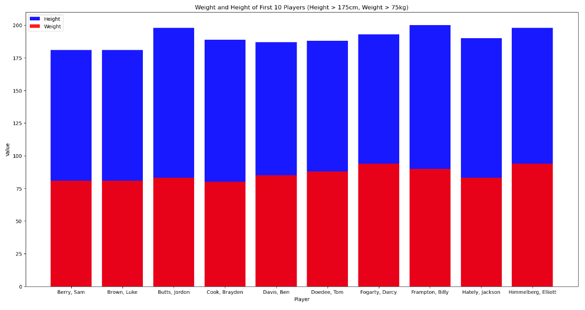

<html>
<body>
<h1>Minipresentation Of Group 3</h1>
<h2>1. Introduction</h2>

Hi, everyone. Today my team wil present how we collect and analyze data.
This is data about the Australian FootBall League including information about playerId,displayName,height,weight,dob,position,origin.And where we collected this? We collect them here on Kaggle.com.This web have many datasets for people to analysis with many topics. We want to study player statistics for the Australian Rules Football League (AFL), use different charts to determine who the main players are, predict performance performance and results. Our aim is to filter information about the players to select the best players. Important players performance that no one has noticed before. With scoring competitions in the AFL as popular as any other sport, surely this is just waiting for Data Science to take over.

First, we updated fiel data to jupyter and type code to have 5 different charts.First chart about the dispersion in the correlation between weight and height of players.

<h2>2. Code and Chart</h2>
Chart 1: 
 dfscatter = df[['weight','height']]
 plt.scatter(dfscatter['weight'], dfscatter['height'], color='pink', s=50, marker='*') 
 plt.ylabel("weight")
 plt.xlabel("height")
 plt.title("The dispersion in the correlation between weight and height of players ") 
 plt.show().  

Describe chart 1:
In this chart we can see, the largest number of points is concentrated in the lower left quadrant, representing players with higher height and greater weight,it ranges from over 170cm - 190cm and from 70kg - under 90kg.
Next, a moderate number of points are concentrated in the middle of the chart representing players with heights from over 190cm - under 200cm and weight from over 90kg - under 100kg.
A small number of points concentrated in the upper right quadrant represent players over 200cm tall and weighing over 110kg.

Chart 2:
 categories = ['Southport', 'South Fremantle', 'GWS', 'Box Hill', 'Ireland']
 player_counts = [4, 5, 3, 3, 3]
 colors = ['#ff9999', '#66b3ff', '#99ff99', '#ffcc99', '#c2c2f0']
 explode = [0.1, 0, 0, 0, 0]
 pie = plt.pie(player_counts, colors=colors, explode=explode,
              autopct='%1.1f%%', shadow=True, startangle=90)
 plt.title('Player Count Percentage')
 legend_box = plt.legend(pie[0], categories, loc='upper right', bbox_to_anchor=(1.5, 0.5))
 legend_box.set_title('Categories', prop={'weight': 'bold'})
 plt.show()  

Describe chart 2:
  1 The pie chart consists of five slices, each representing a different football team. The size of each slice corresponds to the number of players on that team. By visually comparing the sizes of the slices, you can quickly discern the relative player counts for each team. 
2.The South fremantle has the highest amount of qualified players while GWS, Box Hill, ireland share the lowest amount of player
3.Balance Assessment: By comparing the sizes of the slices, you can quickly assess whether the qualified player distribution among the teams is balanced or imbalanced.

Chart 3: 
 import pandas as pd
 import matplotlib.pyplot as plt
 url = 'https://raw.githubusercontent.com/Nganha25/Minipre/main/players.csv?fbclid=IwAR268ZuhWNV5WsMIPsfH4zBp5UKlZEzB2jRDernxEjBM4Dkpws5tQJem4Uk'
 data = pd.read_csv(url)
 filtered_data = data[(data['height'] > 185) & (data['weight'] > 80)].head(10)
 fig, ax = plt.subplots(figsize=(20,10))
 ax.bar(filtered_data['displayName'], filtered_data['height'], label='Height', color='blue', alpha=0.9)
 ax.bar(filtered_data['displayName'], filtered_data['weight'], label='Weight', color='red', alpha=0.9)
 plt.xlabel('Player')
 plt.ylabel('Value')
 plt.title('Weight and Height of First 20 Players (Height > 185cm, Weight > 80kg)')
 plt.legend()
 plt.show()  

Describe chart 3:
The resulting chart will have blue bars representing height and red bars representing weight. 
The x-axis will show the names of the players, and the y-axis will show the values of height and weight. 
The chart will have a legend and a title.Having player heights and weights on a column makes it easy to compare these values and see the correlation between players' heights and weights.
From the chart, we see that all players meet the set index of being over 175 cm tall and weighing over 70 pounds. 
Frampton, Billy is the tallest player at 200cm and he weighs 90kg. This is a player with a beautiful body
Fogarty, Darcy and Himmelberg, Elliott have the same weight of 94 pounds, but Himmelberg , Elliott are taller than Fogarty , Darcy.
Cook, Brayden has the lowest weight on the list at 76 pounds however he has a pretty good height at 189cm
One special thing, Berry, Sam and Brown, Luke are the two shortest people on the list, all at 181cm.

Chart 4: 
 import pandas as pd
 import matplotlib.pyplot as plt
 url = 'https://raw.githubusercontent.com/Nganha25/Minipre/main/players.csv?fbclid=IwAR0gEQdKshg4OvKiAupcOLQ7KSZ4VgmDpX0cilb3OQNkq76DxcRRwHsDByM'
 data = pd.read_csv(url)
 data['dob'] = pd.to_datetime(data['dob'])
 filtered_data = data[(data['dob'].dt.year >= 1998) & (data['dob'].dt.year <= 2003)].head(10)
 fig, ax = plt.subplots(figsize=(10, 7))
 filtered_data['dob'].dt.year.value_counts().sort_index().plot(kind='bar', ax=ax, color='green', label='Year of Birth')
 plt.xlabel('Year of Birth')
 plt.ylabel('Count')
 plt.title('Year of Birth of First 10 Players(between 20-25 years old)')
 plt.legend()
 plt.show()  

Describe chart 4:
The resulting column chart displays the number of players for each year of birth from 1998 to 2003. 
The x-axis represents the years of birth, and the y-axis represents the number of players. The chart will have a green color, a legend, and a title.
Through the chart, we see that there are three players born in 2000 
1998, 1999, 2002 all have 2 players born in these years
There is only 1 player born in 2001

Chart 5: 
 import pandas as pd
 import matplotlib.pyplot as plt
 url = 'https://raw.githubusercontent.com/Nganha25/Minipre/main/players.csv?fbclid=IwAR268ZuhWNV5WsMIPsfH4zBp5UKlZEzB2jRDernxEjBM4Dkpws5tQJem4Uk'
 data = pd.read_csv(url)
 filtered_data = data.head(10)
 position_counts = filtered_data['position'].value_counts()
 fig, ax = plt.subplots(figsize=(8, 8))
 ax.pie(position_counts.values, labels=position_counts.index,  autopct='%1.1f%%')
 plt.title('Position of First 10 Players (Pie Chart)')
 plt.show()  

Describe chart 5:
The resulting pie chart will contain sections corresponding to each player position, 
and the percentage of each position is displayed on the chart. Each section will have a label for the corresponding location. The chart will have a title. 
The position with the highest percentage is defender with 40%.
Forward accounts for 30% in the chart above
Less percent is Midfield, Forward position with 20%
And the lowest is Defender, Midfield

<h2>3. Summarize the presentation</h2>

In conclusion, 5 different charts above have filtered out the best players in positions that match the conditions we offer. Thereby, it is possible to predict which player in which position is best. Furthermore, it will help the team make the correct choice of members to participate in the competition to get the best results. 

</body>
</html>

